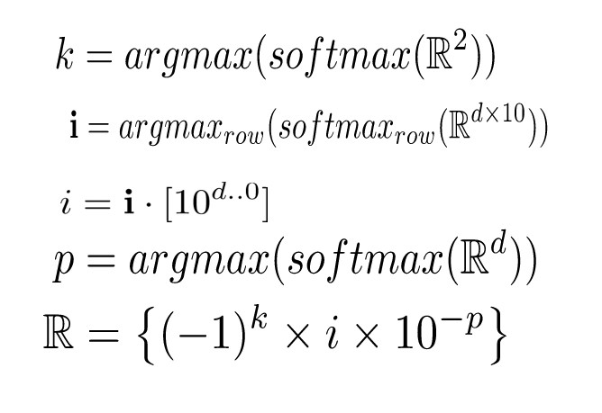

# Real
Real number generation using neural network classification.

Read More: https://gananath.github.io/real.html




# Requirements
- PyTorch 1.6

# Current Result
```
Real: [77.97 48.1 51.95 25.358 71.813 21.05 92.2 84.6 61.4 51.272]
Pred: [77.97, 48.1, 51.95, 49.358000000000004, 46.813, 21.05, 92.2, 84.60000000000001, 61.400000000000006, 29.272000000000002]
```

# Cite

DOI: https://doi.org/10.5281/zenodo.4090437

```
@misc{gananath2016,
  author = {Gananath, R.},
  title = {Real: Real number generation using neural network classification.},
  year = {2020},
  publisher = {GitHub},
  journal = {GitHub repository},
  howpublished = {\url{https://github.com/Gananath/Real}},
  doi = {10.5281/zenodo.4090438 }
}
```
